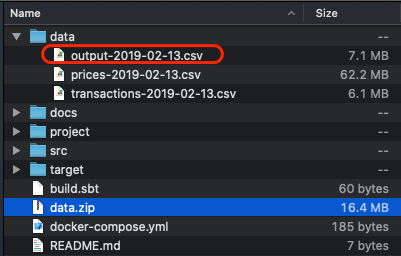

# Price Matching Code

## What is in the repo?

Scala code to read both **data/prices-2019-02-13.csv** & **data/transactions-2019-02-13.csv** to produce the Transaction pricing in file **data/outputs-2019-02-13.csv**

## Steps

- Unzip the data files

```
unzip unzip data.zip -d data
```

- Run the docker compose command (this will use mozilla SBT/Scala image and may take a few minutes in the first pull but should run faster afterwards)

```
docker-compose up
```

You should see the results that looks something like this at the end of the compile and run

```
scala_1  | [info] Loading global plugins from /root/.sbt/1.0/plugins
scala_1  | [info] Loading project definition from /app/project
scala_1  | [info] Loading settings for project app from build.sbt ...
scala_1  | [info] Set current project to oanda (in build file:/app/)
scala_1  | [info] running PriceMatcher
scala_1  | Reading Data
scala_1  |  Read 1520613 Price Points Read 148556 Transactions
scala_1  | Elapsed time: 2103ms
scala_1  | Matching & Printing output
scala_1  | Elapsed time: 1886ms
scala_1  | [success] Total time: 5 s, completed Apr 12, 2020 4:57:03 AM
oanda_scala_1 exited with code 0
```

## Instructions to run if you ahve Scala and SBT installed

Run the following command from the root directory of the project

```
sbt run
```

## output

Should see results in your data folder such as this

